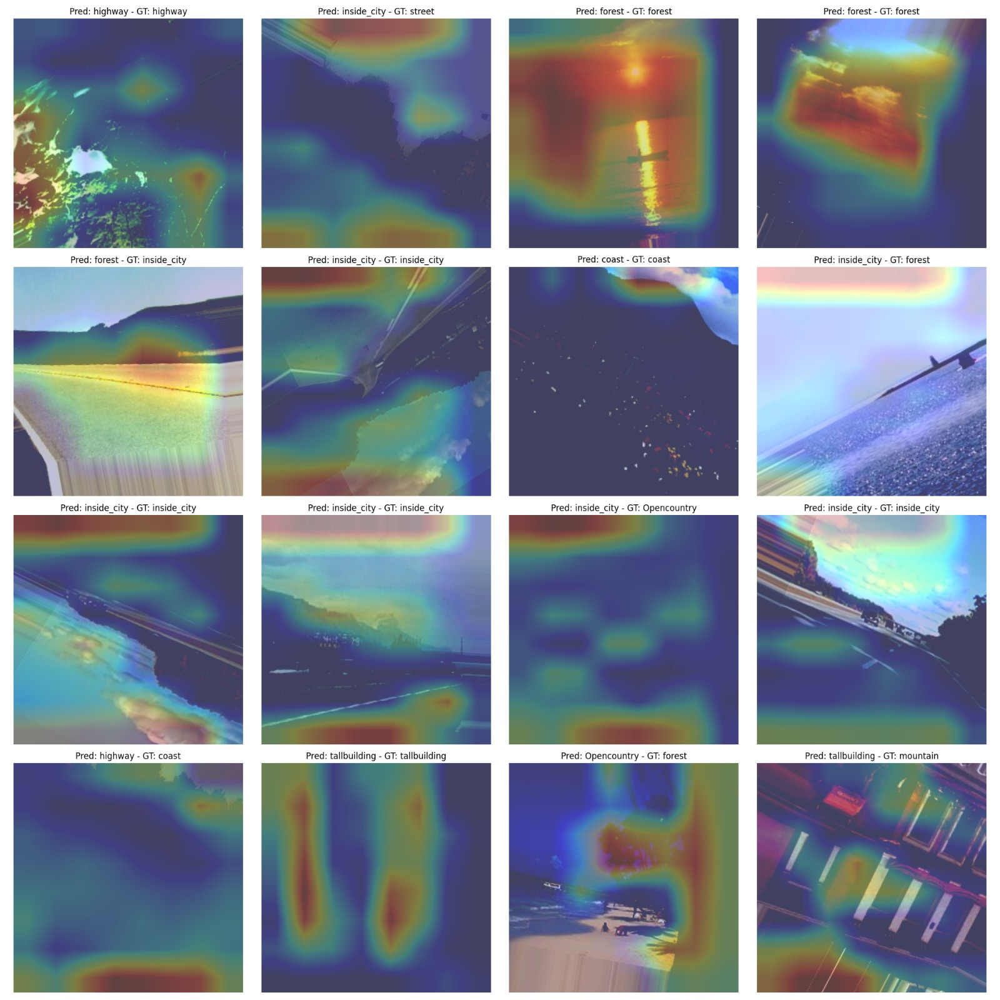
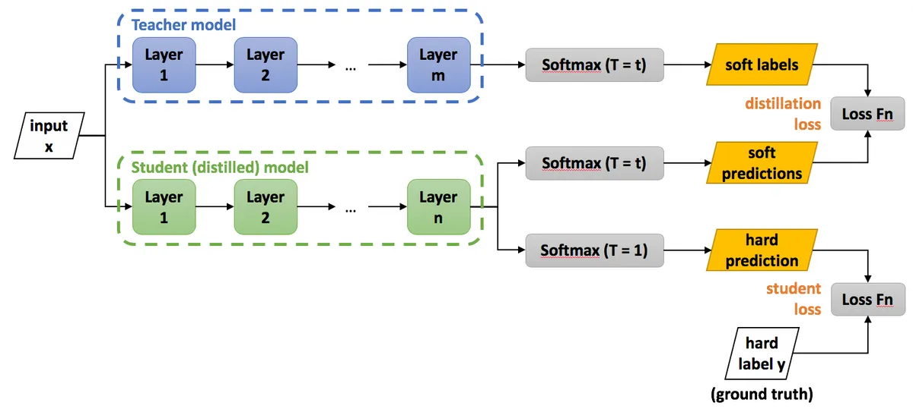
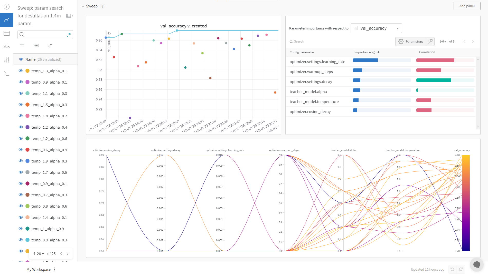
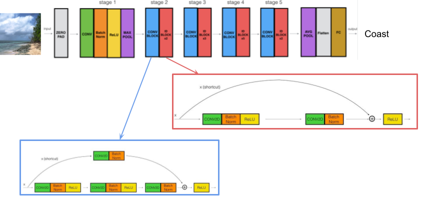
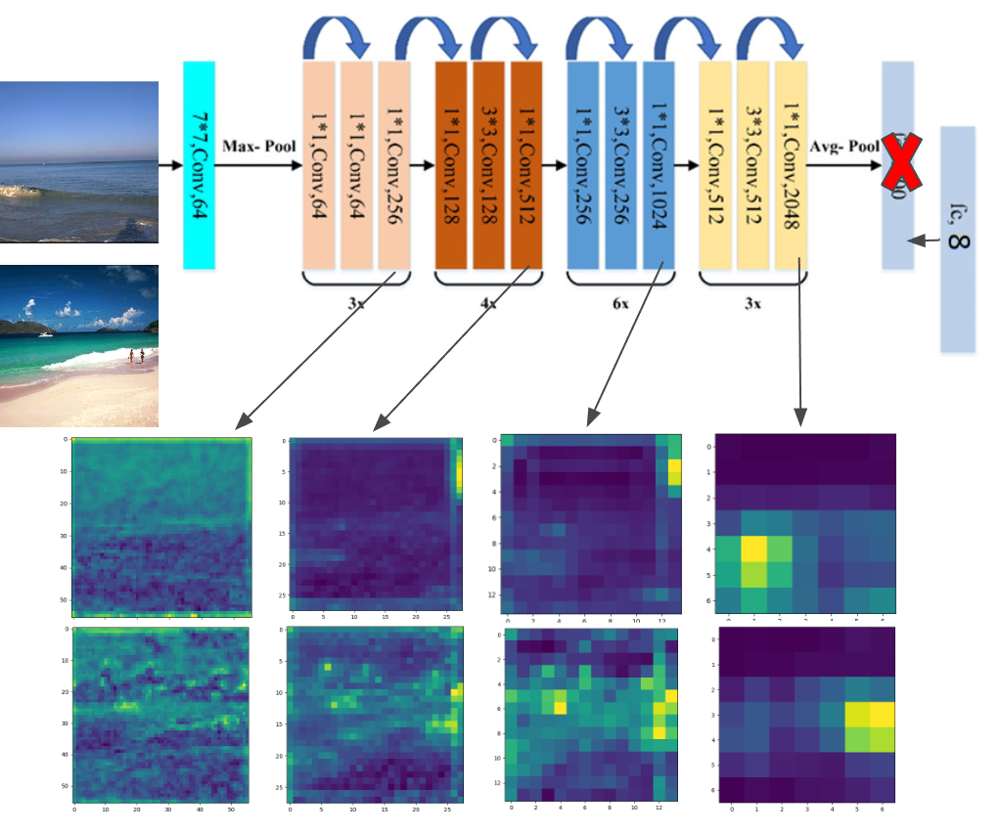
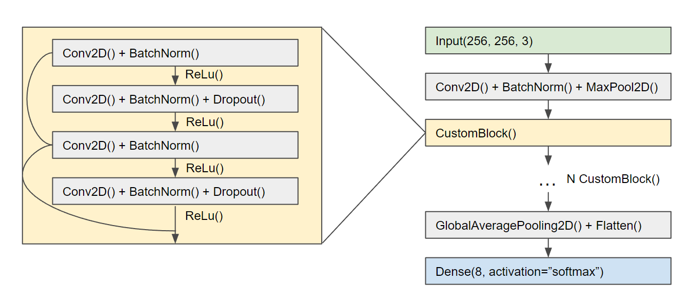
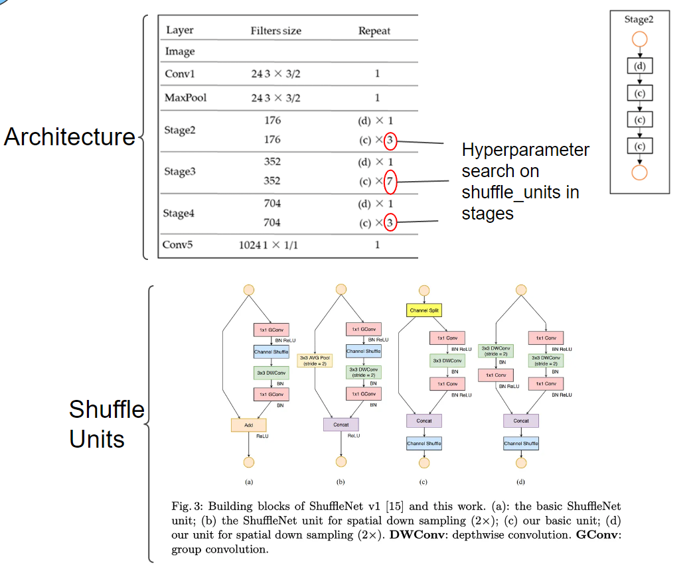

# Image Classification Project
## Table of Contents
- [Introduction](#introduction)
- [Dependencies](#dependencies)
- [How to Run](#how-to-run)
- [Main Function](#main-function)
- [Config Files](#config-files)
- [Sweep Config Files](#sweep-config-file)
- [Authors]()

## Introduction
This project is designed to perform image classification using different Convolutional Neural Network (CNN) models in Keras. It supports three functionalities:
1. Inference and Class Activation Maps



2. Training

3. Knowledge Distillation




## Dependencies
The following python packages are required to run this project:
- tensorflow-gpu
- keras
- wandb
- opencv-python
- numpy
- yaml

## How to Run
To run this project, use the following command in your terminal:
```
python main.py --config <path to yaml config file> --wandb <name of wandb project> --inference <True/False> --distilation <True/False>
```

The config file is used to specify the hyperparameters, data paths, etc. 
The `--wandb` flag is used to specify the name of the W&B project, 
and if set to None, W&B will not be used. 
The `--inference` flag is used to run the project in inference mode and the
`--distilation` flag is a boolean flag to train the specified student network from the
the knowledge of a teacher one.

To run hyperparameter search using Sweep, use the following command in your terminal:

```
python main_sweep.py --sweep=<path_to_yaml> --n_runs=<num_runs> --wandb=<project_name> --inference=<inference_mode> --distilation=<distilation_mode>
```
The code can be run by calling python main_sweep.py and
passing in the required parameters. 
The user can specify the sweep configuration file (`--sweep`), 
the number of runs (`--n_runs`), the name for the WandB project 
(`--wandb`), whether to run the code in inference mode 
(`--inference`), and whether to run the code in distillation mode 
(`--distilation`). The code will automatically train the model 
using the specified parameters and save the final model to disk.

In the wandb project, you will find a Sweep section to analyise the hyperparameter search. For instance:



## Config Files
To run the main, there are 3 neural networks created and possible to use, each with 
a different config file in `config/`folder. 
The different CNNs are:
- Default Keras ResNet50 with modified output layer for certain number of classes and
default weigths to be specified in the config file. You can also select stages you want by selecting the desired output layer.




- Custom ResNet with the number of blocks and channel to be specified:



- ShuffleNetV2 with the scale_factor, bottleneck_ratio and shuffle_units to be specified:




It is important to know that the structure of the train and validation folder must be a seperate folder for each class.

## Sweep config file
Sweep config file will overwrite the parameters of the main config file. In each run, sweep will automatically generate
a value of each hyperparameter and train with these hyperparameters, in seek of maximizing or minimizing the metric specified, in a random way, bayesian or grid search.

To make hyperparameter search just add to the parameters, one with the same name as in the config file.
For instance, if you want to try different preprocessing functions, in the sweep file write this:
```
parameters:
  dataset.preprocessing_function:
    values:
      - tf.keras.applications.resnet50.preprocess_input
      - preprocess_input
```
And in the config file will be overwritten with the chosen one:
```
dataset:
  preprocessing_function: tf.keras.applications.resnet50.preprocess_input
```

## Authors
Josep Bravo (Me) and Miquel Romero (https://github.com/0Miquel)


